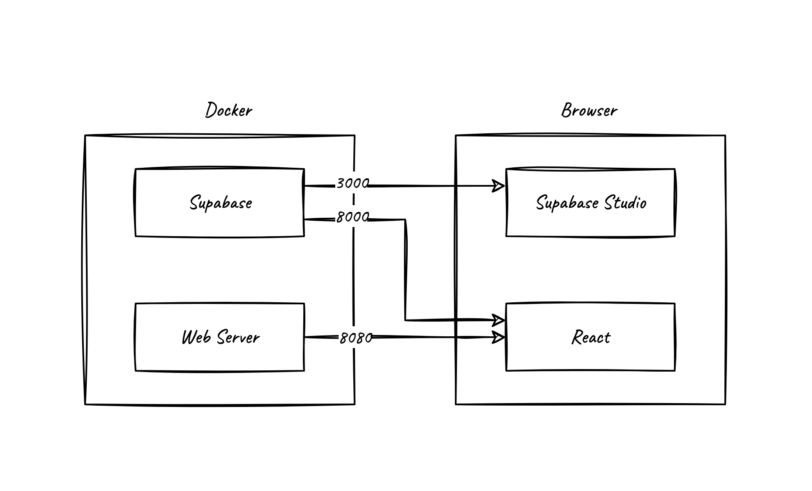
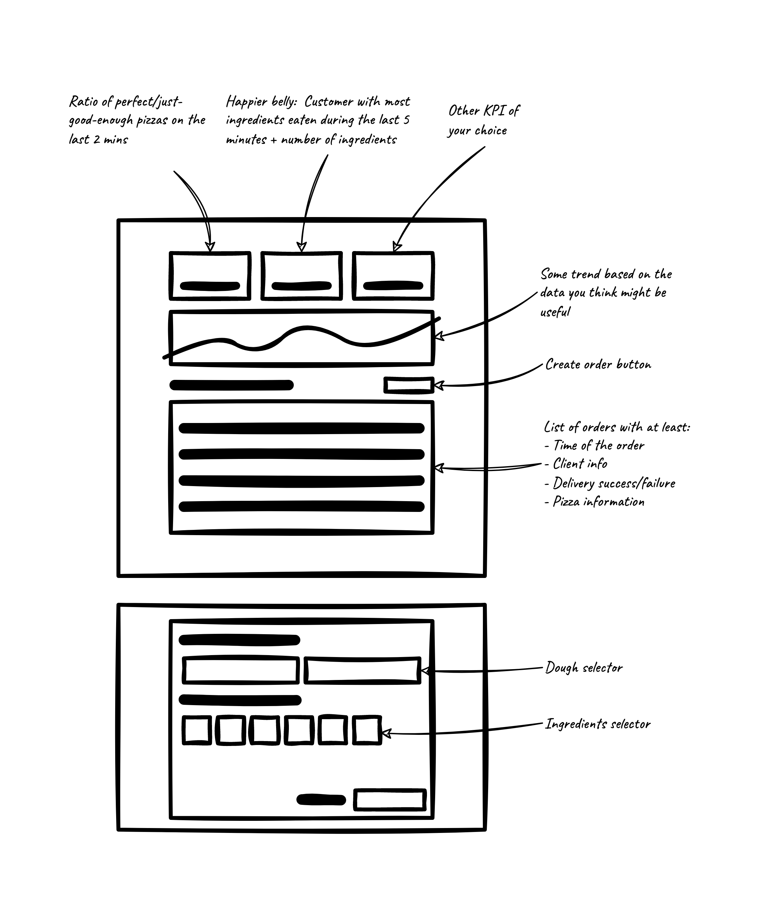
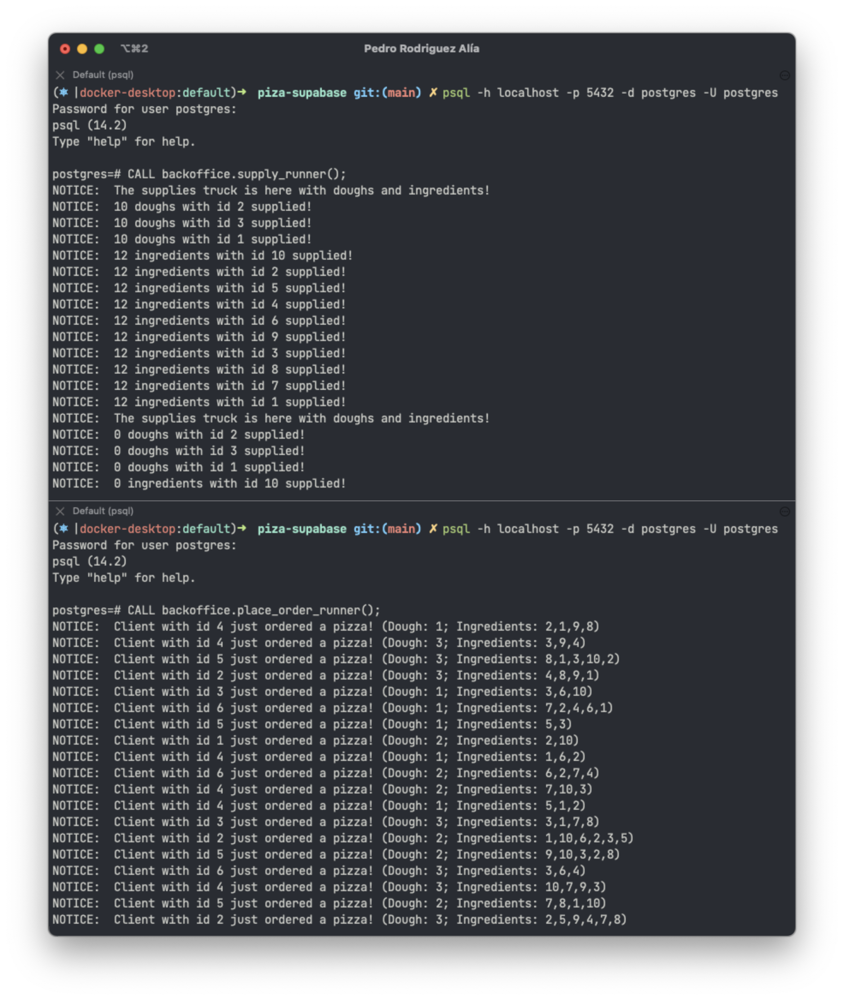

<div align="center">
    
</div>

<br>

Welcome to Piza™! 🎉

We are the **fastest** pizza restaurant in town, with lightspeed cooks and even faster deliveries. 

How is that possible? you may ask. Well, the urgent and impatient nature of our current society has made everything run faster around here. So much faster that we are making pizzas in the blink of an eye and delivering them instantly.

This has brought us huge success and big bucks 💰, but it's also leading us into a productivity bottleneck that we must solve at all costs!

Luckily for us, these big bucks now allow us to hire you, our mighty **full stack developer**, who will be in charge of building a simple, yet effective and well-crafted system that can help us maintain our cheesy greasy toasted bread production rate.

### Goals

The goal of this test is to understand how you perform in a **full stack** development environment using different tools and technologies.

Along with knowledge about the basic stuff such as *git*, *good coding practices*, *package managers* and so on, we expect to see you:

- [ ] Know how to boot up and work with a `dockerized` environment and understand how microservices interact with each other.
- [ ] Build a **react application** (preferably using `typescript`) that communicates with an API and displays data and analytical results.
- [ ] Work with DB functions and triggers to solve a specific task.
- [ ] Perform analytical queries using `SQL`.
- [ ] Document your work in a structured and concise manner that can help us understand your thought process and the evolution of the project throughout its development.
- [ ] Rethink our proposed solutions and come up with better alternatives with strong reasoning behind them.
- [ ] Build a user-friendly interface with a sense of visual balance and good design practices.

We encourage you to ask as many questions as you need before taking on this assignment. We will be happy to give you any extra information or clarification you might need to ease your experience. The main goal of is assignment is to let you show us how you work! The last thing we want is for it to be a waste of your time.

### Tasks

#### The problem

Pizza orders start coming and [they don't stop coming](https://www.youtube.com/watch?v=0Iqr0L4bUms), which has led us to think that maybe it's a good time for some automation on our delivery system.

We need to find a way to respond to these pizza orders by reading the dough and ingredients, checking whether or not we have them in stock, and either crafting the perfect pizza or a just-good-enough one (or not pizza at all). 

We usually try to please our customers with perfect pizzas, but we know that pizza eaters, like us, are no more complex than dull sheep. This means that in times of need we might skip **one** or **two** ingredients (but never the dough, for it would no longer be a pizza 🥺) If the pizza won't suffice our standards we are forced to deny the delivery.

#### The solution

Our tech team needs a hand in building a system that reads the orders from our database, determines whether our cooks can or not fulfill our clients' desires, and either:

- Create a pizza and mark the ingredients as `used` in such pizza, and the order as `delivered`.
- Deny the service by marking the order as `not delivered`.

We also need to be able to visualize in our frontend the following:

- A **list of orders** (in near real-time) together with their ingredients, status, and client information.
- Some **KPIs** that reflect the current situation of our restaurant.
- And last but not least a way for myself (the proud owner) to order a pizza.

#### Tasks

We leave here a list of all the tasks we expect you to do:

##### Mandatory

- [ ] Build a user interface using **React** as described in the implementation details section ([here](#the-react-frontend))
- [ ] Create a set of DB [functions][pg-functions-docs] or [triggers][pg-triggers-docs] that can handle the delivery of the orders.
- [ ] Document your design decisions and your thought process together with the key aspects of your solution.

##### Recommended

- [ ] Write some tests for either or both the systems (frontend/backend) and talk about how coverage works on the documentation. 
- [ ] Modify the database to better fit the system needs by adding *tables*, *views*, *triggers* or anything that could benefit the product.

##### Optional

- [ ] Disable unavailable ingredients/doughs in the frontend.
- [ ] Add authentication and authorization implementations to the frontend and the API ([more on this][supabase-auth-docs]).
- [ ] Any improvement over the infrastructure or the services developed you might think of. Ideally we would love to see these implemented! But if they require too much effort we are also happy to read about them in the documentation.

### Implementation details

Our Piza™ infrastructure is built upon Supabase and a simple web server:

- A **Web Server** that serves our frontend application to the client.
- A **React** frontend for making awesome visualizations and allowing me to order some pizza.

This diagram shows how the infrastructure of the system is implemented:



#### The database

The database consists of a **PostgreSQL** container. It's exposed to the outside world through the port `5432`. This is so you can easily interact with the database using the IDE of your choice or `psql`.

```
$ psql -h localhost -p 5432 -d postgres -U postgres
```

The database has two schemas:

- `public`: This schema has everything you need in order to complete the *required* tasks. 
- `backoffice`: This schema has some configuration tables and the functions that are in charge of creating orders and supplying your restaurant.

While the `backoffice` schema is mostly for configuration and making everything work you are free to inspect it and change it in any way you consider. 

The `public` schema presents the following DER:


This DER only shows the entities and the relationships among them, but the tables have more fields that you might want to use. We leave it up to you to inspect these other fields, however we will describe the key entities and properties that are essential for you to understand how the system works.

##### The `orders` table

This table holds a record for each order that a client makes. The key properties of this table are the `pizza_id` and the `delivery_status` properties.

- `pizza_id`: This property links the order with the pizza that is cooked and delivered to the user.
- `delivery_status`: This property indicates the status of the order which can be either `NULL`, `not delivered` or `delivered`. All orders should start with a `NULL` value in this column, and it's your job to update this value regarding the actions taken on the order.

##### The `stock_xxx` tables

These tables hold the `ingredients` and `doughs` the restaurant has in stock. Whenever they are used to cook a pizza they must be linked to the pizza they were use in using the `pizza_id` column. 

##### The `order_xxx` tables

These tables are used to track the `dough` and `ingredients` of the clients' orders.

#### The API

All these tables are exposed through the [Supabase API][supabase-api-docs]. Supabase provides a RESTful API using PostgREST, a very thin API layer on top of Postgres. It provides everything you need from a CRUD API:

- Basic CRUD operations
- Deeply nested joins, allowing you to fetch data from multiple tables in a single fetch
- Works with Postgres Views
- Works with Postgres Functions
- Works with the Postgres security model - including Row Level Security, Roles, and Grants.

Aswell as tables, [views][pg-views-docs] and [functions][pg-functions-docs] are made available through their own endpoints, so you can use this features to expose more complex analytical queries or to perform transactional operations over the database using just one request. 

Only the `public` schema is exposed by default, but you can always create views in this schema to make tables from other schemas available through the API.

Any upgrade you do on the database should be reflected in the `supabase/db/07_extend_delivery_system.sql` and `database/08_extend_backoffice.sql` depending on which schema you have extended. This will allow us to re-build the system applying your contributions to the source code.

The Piza™ API is well documented in the Supabase Studio ([here](http://localhost:3000/project/default/api)).

#### The React frontend

> You can find the React frontend source code [here](./frontend)

The React frontend should be a simple enough but carefully crafted interface that allows the user to visualize the following information.

- Some **KPIs** about the status of our Piza™ restaurant.
- A **chart** with information of your choice (can be any kind of chart).
- A **table** with detailed information about the orders.
- A way to make an order through a **form**.

We leave here a rough wireframe of what we could be expecting. Again, feel free to propose your solution and reason why you think it's a better fit. You can change in shape and position any of the elements you see in the proposal, or even present the information they contain in any other way. However, we do ask you to build an interface with at least all of the information and possibilities this wireframe has to offer.



Inside the `frontend/` directory you will find a React project with everything you need to get started. You will find the [ElasticUI][elastic-ui-docs] framework installed, which will allow you to quickly develop the proposed interface. This, together with the supabase client, is the only requirement we impose over the building of the frontend, you are free to choose any other library you might want to use. We leave here a list of the ones we use in case it helps you decide:

- Redux + Redux Saga + Reselect
- React Query
- Echarts + Echarts for React
- React Router

### Setup

Setting up the environment is very straight forward. The first time you run it you will need to build the frontend image, so we recommend running the environment with:

```
$ docker-compose up --build -d
```

> The build option is only necessary if you want to build/re-build the frontend image.

To stop the environment you can use:

```
$ docker-compose down
```

This won't erase the data from the database volume, so if you want to start off clean you will need to delete this volume when you stop the environment with `docker-compose`:

```
$ docker-compose down -v
```

> The database initialization scripts located in the `supabase/db/` directory only run if the database is completely empty (i.e: the /var/lib/postgresql/data is empty in the database container/volume). This means that anything within the `supabase/db/` directory will only run the first time you start the environment and won't run again until you manually delete the volume.

When you are ready to start receiving orders just call both the `backoffice.place_order_runner` and `backoffice.supply_runner` procedures.

```sql
-- Make sure to run both runners in independent processes
CALL backoffice.place_order_runner();
CALL backoffice.supply_runner();
```



### Handover

This repository is a template, so all you need to do is create your own repository using this template and send us the link when you are done with it!

Happy coding! 🥳

[pg-functions-docs]: https://www.postgresql.org/docs/current/sql-createfunction.html
[pg-triggers-docs]: https://www.postgresql.org/docs/14/sql-createtrigger.html
[pg-views-docs]: https://www.postgresql.org/docs/14/sql-createview.html
[supabase-auth-docs]: https://supabase.com/docs/guides/auth
[supabase-api-docs]: https://supabase.com/docs/guides/api
[piza-api-docs]: https://documenter.getpostman.com/view/16670336/2s83f5ktKy#3d3a8f95-f752-4872-a798-0d0587eec018
[elastic-ui-docs]: https://elastic.github.io/eui/#/